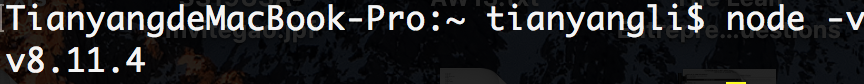
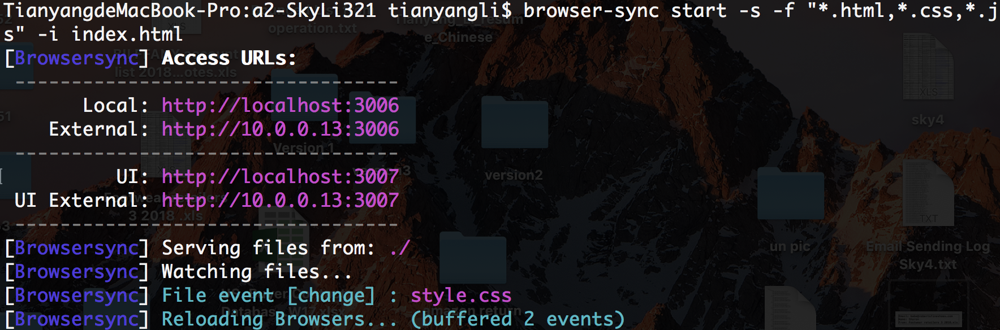
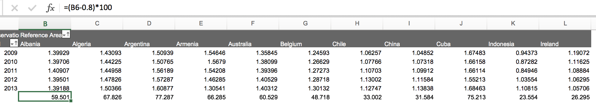
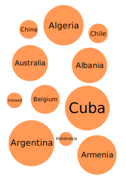
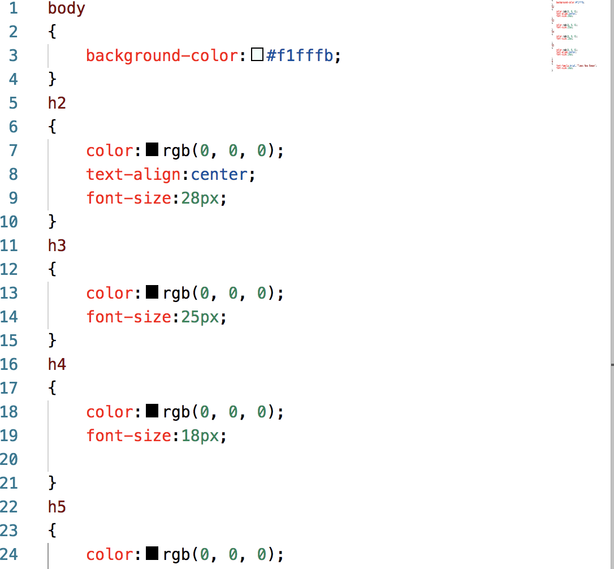
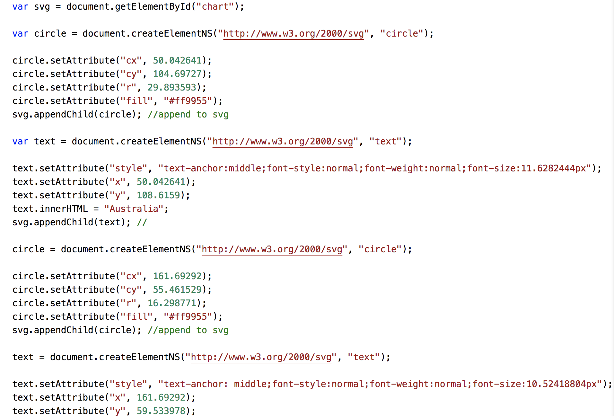

# INF 554 Assignment 2 - Tianyang Li - 4897703498
## Install Node.js





## Use browser-sync



## How to make the index.html

### Explination of data source

Firstly, write the descriptions and the provenance of the dataset

### Make the Chart 1
1. Use the Google Sheet made in Assignment1.
Choose a year and filter the data.

2. Use Inkscope to draw the bubble cloud. Each bubble represent a country.

3. Find a appropriate mapping between the value in dataset and the radius of bubble. After testing, I chose the mapping formula rule below:

    Radius = (ObservationValue - 0.8)*100 (mm)<br>
    Example:<br>
    (Radius of China = (1.11584-0.8)*100 = 31.584)<br>
    (1.11584 is China's observation value)<br>

4. Calculate the radius of each bubble

    

5. Finish the bubble cloud and align it

6. Use the html code below to make chart 1(embeding as .svg file)
```html
<a href="#"></a>
```

### Make the Chart 2
1. Check the position and size information from .svg file. Write the svg code in html. (Use viewbox to adjust the size of chart)
    ```html
    <svg xmlns="http://www.w3.org/2000/svg" version="1.1" 
        width = "700"
        height = "600"
        viewbox = "0,40,340,220">      
        <g>
        <circle
          style="display:inline;opacity:1;fill:#ff9955;stroke-width:0.28277746"
          
          cx="50.042641"
          cy="104.69727"
          r="29.893593" />
        <text
          
          style="text-anchor:middle;font-style:normal;font-weight:normal;font-size:11.6282444px;line-height:1.25;font-family:sans-serif;letter-spacing:0px;word-spacing:0px;display:inline;fill:#000000;fill-opacity:1;stroke:none;stroke-width:0.29070613"
          x="50.042641"
          y="108.6159"
          >Australia</text>
    ```
        .
        .
        .

2. Use "style.css" to adjust the font size and backgroud

    

### Make the Chart 3
1. Write JavaScript code to creat svg with an id in external "chart.js" file. 

    

   (just part of the code)

2. Load the "chart.js" and get the svg by id.

    ```html
    <svg id="chart" 
        width = "700"
        height = "600"
        viewbox = "0,40,340,220"
        ></svg>
    <script src="chart.js"></script>
    ```

## Finished!
